# Agent Card Database Schema for A2A Protocol

This schema defines a PostgreSQL database structure for storing Agent2Agent (A2A) protocol agent cards.

This schema also defines a set of tables and strategies for human interactions in the agentic flow

## Key Design Decisions

1. **Normalized Structure**: The database design is normalized to reduce redundancy and maintain data integrity.

2. **One-to-One and One-to-Many Relationships**: Each agent card has one provider and one set of capabilities, but can have multiple skills, authentication schemes, and input/output modes.

3. **Timestamps**: Timestamps track when records are created and updated, which is helpful for versioning and auditing.

4. **Flexible Mode Storage**: Input and output modes are stored in a way that supports both agent-level defaults and skill-specific modes.

5. **Cascading Deletes**: When an agent card is deleted, all related records are automatically deleted to maintain referential integrity.

6. **State Preservation for Human Intervention**: The system maintains the complete state of agent tasks when human intervention is requested, allowing seamless resumption of the workflow after human input.

## Entity Relationships

- **agent_cards**: The central entity representing an A2A agent
- **agent_providers**: One-to-one relationship with agent_cards
- **agent_capabilities**: One-to-one relationship with agent_cards
- **agent_authentication**: One-to-one relationship with agent_cards
- **agent_auth_schemes**: Many-to-one relationship with agent_authentication
- **agent_modes**: Many-to-one relationship with agent_cards
- **agent_skills**: Many-to-one relationship with agent_cards
- **agent_skill_tags**: Many-to-one relationship with agent_skills
- **agent_skill_examples**: Many-to-one relationship with agent_skills
- **agent_skill_modes**: Many-to-one relationship with agent_skills
- **human_intervention_requests**: Many-to-one relationship with agent_cards
- **intervention_context**: Many-to-one relationship with human_intervention_requests
- **human_operators**: Independent entity for human staff management
- **intervention_assignments**: Many-to-many relationship between human_operators and human_intervention_requests
- **intervention_actions**: Records of actions taken by human operators

## Human Intervention Workflow

The human intervention extension enables a "suspend and resume" pattern for agent workflows:

1. When an agent encounters a situation requiring human judgment, it initiates a human intervention request
2. The system preserves the complete state of the task in the intervention_context table
3. Human operators are assigned to review and address the request
4. Human decisions and actions are recorded in the intervention_actions table
5. Upon resolution, the agent can retrieve both the intervention outcome and its previous state
6. The agent workflow resumes from exactly where it left off

This design supports both synchronous interventions (where an agent waits for human input) and asynchronous interventions (where requests are queued for later review). The callback mechanism allows for automatic notification when human intervention is complete.

The human intervention tables create a comprehensive audit trail of when human judgment was required in agentic workflows, which is valuable for understanding, debugging, and improving agent performance over time.

```mermaid
erDiagram
    agent_cards {
        int id PK
        string name
        json description
        string icon
        timestamp created_at
        timestamp updated_at
    }
    
    agent_providers {
        int id PK
        int agent_card_id FK
        string provider_name
        json provider_data
        timestamp created_at
    }
    
    agent_capabilities {
        int id PK
        int agent_card_id FK
        string capability_name
        json capability_data
        timestamp created_at
    }
    
    agent_authentication {
        int id PK
        int agent_card_id FK
        string credentials
        timestamp created_at
        timestamp updated_at
    }
    
    agent_auth_schemes {
        int id PK
        int agent_authentication_id FK
        string scheme
        timestamp created_at
    }
    
    agent_modes {
        int id PK
        int agent_card_id FK
        string mode
        timestamp created_at
    }
    
    agent_skills {
        int id PK
        int agent_card_id FK
        string name
        string description
        timestamp created_at
        timestamp updated_at
    }
    
    agent_skill_tags {
        int id PK
        int agent_skill_id FK
        string tag
        timestamp created_at
    }
    
    agent_skill_examples {
        int id PK
        int agent_skill_id FK
        string example
        timestamp created_at
    }
    
    agent_skill_modes {
        int id PK
        int agent_skill_id FK
        string mode
        timestamp created_at
    }
    
    human_intervention_requests {
        int id PK
        int agent_card_id FK
        string status
        timestamp created_at
        timestamp updated_at
        timestamp resolved_at
    }
    
    intervention_context {
        int id PK
        int intervention_id FK
        string context_type
        json context_data
        timestamp created_at
    }
    
    human_operators {
        int id PK
        string name
        string email
        timestamp created_at
    }
    
    intervention_assignments {
        int id PK
        int intervention_id FK
        int operator_id FK
        timestamp assigned_at
        timestamp accepted_at
        timestamp completed_at
    }
    
    intervention_actions {
        int id PK
        int intervention_id FK
        int operator_id FK
        string action_type
        json action_data
        timestamp created_at
    }
    
    agent_cards ||--o{ agent_providers : "has"
    agent_cards ||--o{ agent_capabilities : "has"
    agent_cards ||--o{ agent_authentication : "has"
    agent_cards ||--o{ agent_modes : "has"
    agent_cards ||--o{ agent_skills : "has"
    agent_cards ||--o{ human_intervention_requests : "requests"
    
    agent_authentication ||--o{ agent_auth_schemes : "uses"
    
    agent_skills ||--o{ agent_skill_tags : "tagged with"
    agent_skills ||--o{ agent_skill_examples : "has"
    agent_skills ||--o{ agent_skill_modes : "supports"
    
    human_intervention_requests ||--o{ intervention_context : "provides"
    human_intervention_requests ||--o{ intervention_assignments : "assigned to"
    human_intervention_requests ||--o{ intervention_actions : "resolved by"
    
    human_operators ||--o{ intervention_assignments : "accepts"
    human_operators ||--o{ intervention_actions : "performs"
```

